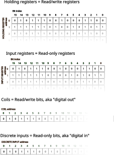
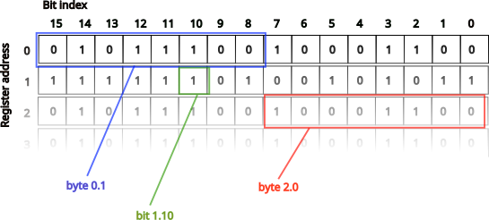
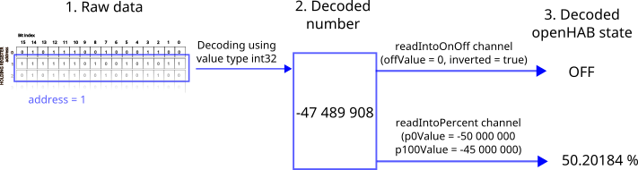
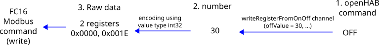

# Modbus Binding

This is the binding to access Modbus TCP and serial slaves.
RTU, ASCII and BIN variants of Serial Modbus are supported.
Modbus TCP slaves are usually also called as Modbus TCP servers.

The binding can act as

- Modbus TCP Client (also known as modbus master), querying data from Modbus TCP servers (also known as modbus slaves)
- Modbus serial master, querying data from modbus serial slaves

The binding supports "Modbus RTU over Modbus TCP" as well as normal "Modbus TCP".
"Modbus RTU over Modbus TCP" is also known as "Modbus over TCP/IP" or "Modbus over TCP" or "Modbus RTU/IP".

The Modbus binding polls the slave data with a configurable poll period.
openHAB commands are translated to write requests.

The binding has the following extensions:

<!--list-subs-->

The rest of this page contains details for configuring this binding:

{::options toc_levels="2..4"/}

- TOC
{:toc}

## Main Features

The binding polls (or _reads_) Modbus data using function codes (FC) FC01 (Read coils), FC02 (Read discrete inputs), FC03 (Read multiple holding registers) or FC04 (Read input registers).
This polled data is converted to data suitable for use in openHAB.
Functionality exists to interpret typical number formats (e.g. single precision float).

The binding can also _write_ data to Modbus slaves using FC05 (Write single coil), FC06 (Write single holding register), FC15 (Write multiple coils) or FC16 (Write multiple holding registers).

## Caveats And Limitations

Please note the following caveats or limitations

- The binding does _not_ act as Modbus slave (e.g. as Modbus TCP server).


## Modbus Basics

Modbus is very low-level protocol, and understanding of basic concepts is required to use this binding.

Easiest way to think is that Modbus simply a protocol to read/write arbitrary memory data over TCP or Serial line.

In order to read or write data over Modbus, one needs to know several things
1. Data type to use
2. Address of the entity element to read/write
3. Encoding to make sense of the data

### Data types

There are four types of data in Modbus, illustrated below



| Data type         | Read/Write     | Element Size      |
|-------------------|----------------|-------------------|
| Holding registers | Read and write | 16 bits = 2 bytes |
| Input registers   | Read only      | 16 bits = 2 bytes |
| Coils             | Read and write | 1 bit             |
| Discrete inputs   | Read only      | 1 bit             |

Registers are often used to communicate measurement values, e.g. temperature setting, valve position.
Coils and discrete inputs to represent binary on/off values, e.g. valve open/closed, heating on/off.

In Modbus, reading and writing of data is conducted via commands (also known as "Function Code" or FC):

| Data type         | Read FC | Write FC                              |
|-------------------|---------|---------------------------------------|
| Holding registers | 3       | 6 (write single), 16 (write multiple) |
| Input registers   | 4       | N/A                                   |
| Coils             | 1       | 5 (write single), 15 (write multiple) |
| Discrete inputs   | 2       | N/A                                   |

FC05 and FC06 can write only exactly one coil/holding register.
FC15 and FC16 can write one or more coils/holding registers.

By default, binding uses FC05/FC06 when writing one element, and FC15/FC16 otherweise.
Unfortunately, some devices only support writing via FC15/FC16, even with single element.
For this purpose, there is configuration parameter "Write using FC15 always" (with coils) and "Write using FC16 always" (with holding registers).

### Addressing

Modbus addressing is general source of confusion, and often it is hard to figure out right address to use.

[Modbus Wikipedia article](https://en.wikipedia.org/wiki/Modbus#Coil.2C_discrete_input.2C_input_register.2C_holding_register_numbers_and_addresses) summarizes adressing in a compact way:

> In the traditional standard, [entity] numbers for those entities start with a digit, followed by a number of four digits in range 1–9,999:
>
> - coils *numbers* start with a **zero** and then span from **0**0001 to **0**09999
> - discrete input *numbers* start with a **one** and then span from **1**00001 to **1**09999
> - input register *numbers* start with a **three** and then span from **3**00001 to **3**09999
> - holding register *numbers* start with a **four** and then span from **4**00001 to **4**09999
>
> This translates into [entity] *addresses* between 0 and 9,998 in data frames.

Note that entity begins counting at 1, data frame address at 0.

The openHAB modbus binding uses data frame *addresses* when referring to modbus data.
First element starts with data frame address 0.

Picture below illustrates addressing register data in the binding



Adressing single bit:
- address is given as `X.Y`, where `Y` is between 0...15 (inclusive), representing bit of the register `X`
- index `Y=0` refers to the least significant bit
- index `Y=1` refers to the second least significant bit, etc.

Adressing single byte (8 bits):

- address is given as `X.Y`, where `Y` is between 0...1 (inclusive), representing byte of the register `X`
- index `Y=0` refers to low byte
- index `Y=1` refers to high byte

Addressing single register (16 bits):

- address is given as `X` where `X` the register address (starting from zero)

Adressing multiple registers:

- address is given as `X`. It specifies the address of the first register.


### Data Encoding and Value Type

Modbus data types are extremely low level: they should be considered as raw binary data.

In order to make sense out of the data, one needs to know the *encoding* of the binary data.

For example, register having value `0xFFCC` can mean many things
- -52 if register is interpreted as *signed* 16bit integer (encoded as two's complement)
- 65484 if register is interpreted as *unsigned* 16bit integer
- two numbers, 255 and 204, if register is interpreted as 2 unsigned 8bit integers (`0xFF` and `0xCC`)
- 16 bits, each having on/off status: 11111111 11001100

Since register can contain only 16 bits, sometimes multiple registers are used to construct numbers with larger range/higher accuracy, for example
- 2 consecutive registers can represent one unsigned 32 bit integer or one 32 bit floating point numbers ("IEEE754 single precision float")
- 4 consecutive registers can represent one signed 64 bit integer

With more than one, there are varying conventions how registers should be combined to interpret the data.
For example, should two registers`0x4048` `0xF5C3` be treated as 32 bit floating point number
- `0x4048F5C3` = 3.14
- or `0xF5C34048` = -4.95020344754211973390081124729 * 10^32  (registers "swapped")?

You need to refer to your device manual for the correct interpretation, or simply try both encodings.
Both encodings are supported by the binding.

The process of decoding Modbus binary data read from device into openHAB item state is illustrated below:



The steps are 
1. Decode raw Modbus data using address and value type into number
2. Optional: Post-process number, e.g. into ON/OFF or into percent
3. Update channel with post-processed state


The process would be similar in inverse when processing openHAB commands, and writing to holding registers using `writeRegisterFromXX` channel.



The steps to write registers are as follows
1. Convert openHAB command into a number
2. Encode number into binary using value type
3. Construct Modbus write command (FC06 or FC16) with the binary data

When writing partial register, i.e. `address` = X.Y (e.g. writing single bit of register), a previously read full-register value is combined with the command.

The steps to write coils are as follows
1. Convert openHAB command into a on/off bit
2. Construct Modbus write command (FC05 or FC15) with the binary data

Data encoding/decoding is specified using **value type parameter**, explanations below:

#### `bit`:

- a single bit is read from the registers
- address is given as `X.Y`, where `Y` is between 0...15 (inclusive), representing bit of the register `X`
- index `Y=0` refers to the least significant bit
- index `Y=1` refers to the second least significant bit, etc.

#### `int8`:

- a byte (8 bits) from the registers is interpreted as signed integer
- address is given as `X.Y`, where `Y` is between 0...1 (inclusive), representing byte of the register `X`
- index `Y=0` refers to low byte
- index `Y=1` refers to high byte
- it is assumed that each high and low byte is encoded in most significant bit first order

#### `uint8`:

- same as `int8` except value is interpreted as unsigned integer

#### `int16`:

- register with index is interpreted as 16 bit signed integer.
- it is assumed that register is encoded in most significant bit first order

#### `uint16`:

- same as `int16` except value is interpreted as unsigned integer

#### `int32`:

- registers `index` and `(index + 1)` are interpreted as signed 32bit integer
- it assumed that the first register contains the most significant 16 bits
- it is assumed that each register is encoded in most significant bit first order

#### `uint32`:

- same as `int32` except value is interpreted as unsigned integer

#### `float32`:

- registers `index` and `(index + 1)` are interpreted as signed 32bit floating point number
- it assumed that the first register contains the most significant 16 bits
- it is assumed that each register is encoded in most significant bit first order

#### `int64`:

- registers `index`, `(index + 1)`, `(index + 2)`, `(index + 3)` are interpreted as signed 64bit integer.
- it assumed that the first register contains the most significant 16 bits
- it is assumed that each register is encoded in most significant bit first order

#### `uint64`:

- same as `int64` except value is interpreted as unsigned integer

The MODBUS specification defines each 16bit word to be encoded as Big Endian,
but there is no specification on the order of those words within 32bit or larger data types.
The net result is that when you have a master and slave that operate with the same Endian mode things work fine,
but add a device with a different Endian mode and it is very hard to correct.
To resolve this the binding supports a second set of valuetypes that have the words swapped.

If you get strange values using the `int32`, `uint32`, `float32`, `int64`, or `uint64` valuetypes then just try the `int32_swap`, `uint32_swap`, `float32_swap`, `int64_swap`, or `uint64_swap` valuetype, depending upon what your data type is.

#### `int32_swap`:

- registers `index` and `(index + 1)` are interpreted as signed 32bit integer
- it assumed that the first register contains the least significant 16 bits
- it is assumed that each register is encoded in most significant bit first order (Big Endian)

#### `uint32_swap`:

- same as `int32_swap` except value is interpreted as unsigned integer

#### `float32_swap`:

- registers `index` and `(index + 1)` are interpreted as signed 32bit floating point number
- it assumed that the first register contains the least significant 16 bits
- it is assumed that each register is encoded in most significant bit first order (Big Endian)

#### `int64_swap`:

- same as `int64` but registers swapped, that is, registers (index + 3), (index + 2), (index + 1), (index + 1) are interpreted as signed 64bit integer

#### `uint64_swap`:

- same as `uint64` except value is interpreted as unsigned integer


### Further Background Material

Reader of the documentation should understand the basics of Modbus protocol.
Good sources for further information:

- [Wikipedia article](https://en.wikipedia.org/wiki/Modbus): good read on modbus basics and addressing.
- [Simplymodbus.ca](https://www.simplymodbus.ca/): good reference as well as excellent tutorial like explanation of the protocol

Useful tools

- [binaryconvert.com](https://www.binaryconvert.com/): tool to convert numbers between different binary presentations
- [rapidscada.net Modbus parser](https://modbus.rapidscada.net/): tool to parse Modbus requests and responses. Useful for debugging purposes when you want to understand the message sent / received.
- [JSFiddle tool](https://jsfiddle.net/rgypuuxq/) to test JavaScript (JS) transformations interactively

## Supported Things

This binding supports 4 different things types

| Thing    | Type   | Description                                                                                                                                                                                                                 |
|----------|--------|-----------------------------------------------------------------------------------------------------------------------------------------------------------------------------------------------------------------------------|
| `tcp`    | Bridge | Modbus TCP server (Modbus TCP slave)                                                                                                                                                                                        |
| `serial` | Bridge | Modbus serial slave                                                                                                                                                                                                         |
| `poller` | Bridge | Reads data from Modbus device, with a regular interval. One poller corresponds to single Modbus read request (FC01, FC02, FC03, or FC04). Is child of `tcp` or `serial`. Also translates commands to Modbus write requests (FC05/FC15 and FC06/FC16). |

Typically one defines either `tcp` or `serial` bridge, depending on the variant of Modbus device (Modbus slave) communicating with.
For each Modbus read request, a `poller` is defined.

## Binding Configuration

Other than the things themselves, there is no binding configuration.

## Serial Port Configuration

With serial Modbus slaves, configuration of the serial port in openHAB is important.
Otherwise you might encounter errors preventing all communication.

See [general documentation about serial port configuration](/docs/administration/serial.html) to configure the serial port correctly.

## Thing Configuration

In the tables below the thing configuration parameters are grouped by thing type.

Things can be configured using the UI, or using a `.things` file.

### `tcp` Thing

`tcp` is representing a particular Modbus TCP server (slave).

Basic parameters

| Parameter in UI        | Parameter in text configuration | Type    | Required | Default if omitted | Description                                                 |
|------------------------|---------------------------------|---------|----------|--------------------|-------------------------------------------------------------|
| IP Address or Hostname | `host`                          | text    |          | `"localhost"`      | IP address or hostname                                      |
| Port                   | `port`                          | integer |          | `502`              | Port number                                                 |
| Id                     | `id`                            | integer |          | `1`                | Slave id. Also known as station address or unit identifier. |
| RTU Encoding           | `rtuEncoded`                    | boolean |          | `false`            | Use RTU encoding instead of regular TCP encoding.           |

Advanced parameters

| Parameter in UI                         | Parameter in text configuration | Required | Type    | Default if omitted | Description                                                                                                                                                                                   |
|-----------------------------------------|---------------------------------|----------|---------|--------------------|-----------------------------------------------------------------------------------------------------------------------------------------------------------------------------------------------|
| Time Between Transactions               | `timeBetweenTransactionsMillis` |          | integer | `60`               | How long to delay we must have at minimum between two consecutive MODBUS transactions. In milliseconds.                                                                                       |
| Time Between Reconnections              | `timeBetweenReconnectMillis`    |          | integer | `0`                | How long to wait to before trying to establish a new connection after the previous one has been disconnected. In milliseconds.                                                                |
| Maximum Connection Tries                | `connectMaxTries`               |          | integer | `1`                | How many times we try to establish the connection. Should be at least 1.                                                                                                                      |
| Connection warm-up time                 | `afterConnectionDelayMillis`    |          | integer | `0`                | Connection warm-up time. Additional time which is spent on preparing connection which should be spent waiting while end device is getting ready to answer first modbus call. In milliseconds. |
| Reconnect Again After                   | `reconnectAfterMillis`          |          | integer | `0`                | The connection is kept open at least the time specified here. Value of zero means that connection is disconnected after every MODBUS transaction. In milliseconds.                            |
| Timeout for Establishing the Connection | `connectTimeoutMillis`          |          | integer | `10000`            | The maximum time that is waited when establishing the connection. Value of zero means that system/OS default is respected. In milliseconds.                                                   |
| Discovery Enabled                       | `enableDiscovery`               |          | boolean | false              | Enable auto-discovery feature. Effective only if a supporting extension has been installed.                                                                                                   |

**Note:** Advanced parameters must be equal for all `tcp` things sharing the same `host` and `port`.

The advanced parameters have conservative defaults, meaning that they should work for most users.
In some cases when extreme performance is required (e.g. poll period below 10 ms), one might want to decrease the delay parameters, especially `timeBetweenTransactionsMillis`.
Similarly, with some slower devices on might need to increase the values.

### `serial` Thing

`serial` is representing a particular Modbus serial slave.

Basic parameters

| Parameter in UI | Parameter in text configuration | Type    | Required | Default if omitted | Description                                                                                                                                                                                                |  |
|-----------------|---------------------------------|---------|----------|--------------------|------------------------------------------------------------------------------------------------------------------------------------------------------------------------------------------------------------|--|
| Serial port     | `port`                          | text    | ✓        |                    | Serial port to use, for example `"/dev/ttyS0"` or `"COM1"`                                                                                                                                                 |  |
| Id              | `id`                            | integer |          | `1`                | Slave id. Also known as station address or unit identifier. See [Wikipedia](https://en.wikipedia.org/wiki/Modbus) and [simplymodbus](https://www.simplymodbus.ca/index.html) articles for more information |  |
| Baud            | `baud`                          | integer | ✓        |                    | Baud of the connection. Valid values are: `75`, `110`, `300`, `1200`, `2400`, `4800`, `9600`, `19200`, `38400`, `57600`, `115200`.                                                                         |  |
| Stop Bits       | `stopBits`                      | text    | ✓        |                    | Stop bits. Valid values are: `"1.0"`, `"1.5"`, `"2.0"`.                                                                                                                                                    |  |
| Parity          | `parity`                        | text    | ✓        |                    | Parity. Valid values are: `"none"`, `"even"`, `"odd"`.                                                                                                                                                     |  |
| Data Bits       | `dataBits`                      | integer | ✓        |                    | Data bits. Valid values are: `5`, `6`, `7` and `8`.                                                                                                                                                        |  |
| Encoding        | `encoding`                      | text    |          | `"rtu"`            | Encoding. Valid values are: `"ascii"`, `"rtu"`, `"bin"`.                                                                                                                                                   |  |
| RS485 Echo Mode | `echo`                          | boolean |          | `false`            | Flag for setting the RS485 echo mode. This controls whether we should try to read back whatever we send on the line, before reading the response. Valid values are: `true`, `false`.                       |  |

Advanced parameters

| Parameter in UI                         | Parameter in text configuration | Required | Type    | Default if omitted | Description                                                                                                                                                                                   |
|-----------------------------------------|---------------------------------|----------|---------|--------------------|-----------------------------------------------------------------------------------------------------------------------------------------------------------------------------------------------|
| Read Operation Timeout                  | `receiveTimeoutMillis`          |          | integer | `1500`             | Timeout for read operations. In milliseconds.                                                                                                                                                 |
| Flow Control In                         | `flowControlIn`                 |          | text    | `"none"`           | Type of flow control for receiving. Valid values are: `"none"`, `"xon/xoff in"`, `"rts/cts in"`.                                                                                              |
| Flow Control Out                        | `flowControlOut`                |          | text    | `"none"`           | Type of flow control for sending. Valid values are: `"none"`, `"xon/xoff out"`, `"rts/cts out"`.                                                                                              |
| Time Between Transactions               | `timeBetweenTransactionsMillis` |          | integer | `35`               | How long to delay we must have at minimum between two consecutive MODBUS transactions. In milliseconds.                                                                                       |
| Maximum Connection Tries                | `connectMaxTries`               |          | integer | `1`                | How many times we try to establish the connection. Should be at least 1.                                                                                                                      |
| Connection warm-up time                 | `afterConnectionDelayMillis`    |          | integer | `0`                | Connection warm-up time. Additional time which is spent on preparing connection which should be spent waiting while end device is getting ready to answer first modbus call. In milliseconds. |
| Timeout for Establishing the Connection | `connectTimeoutMillis`          |          | integer | `10000`            | The maximum time that is waited when establishing the connection. Value of zero means thatsystem/OS default is respected. In milliseconds.                                                    |
| Discovery Enabled                       | `enableDiscovery`               |          | boolean | false              | Enable auto-discovery feature. Effective only if a supporting extension has been installed.                                                                                                   |

With the exception of `id` parameters should be equal for all `serial` things sharing the same `port`.

These parameters have conservative defaults, meaning that they should work for most users.
In some cases when extreme performance is required (e.g. poll period below 10ms), one might want to decrease the delay parameters, especially `timeBetweenTransactionsMillis`.
With some slower devices on might need to increase the values.

With low baud rates and/or long read requests (that is, many items polled), there might be need to increase the read timeout `receiveTimeoutMillis` to e.g. `5000` (=5 seconds).

### `poller` Thing

`poller` thing takes care of polling the Modbus serial slave or Modbus TCP server data with regular intervals.
Poller is also responsible of converting openHAB commands into Modbus write requests.

| UI Parameter               | Parameter in text configuration | Type    | Required | Default if omitted | Description                                                                                                                                                                                    |
|----------------------------|---------------------------------|---------|----------|--------------------|------------------------------------------------------------------------------------------------------------------------------------------------------------------------------------------------|
| Start                      | `start`                         | integer |          | `0`                | Address of the first register, coil, or discrete input to poll. Input as zero-based index number.                                                                                              |
| Length                     | `length`                        | integer | ✓        | (-)                | Number of registers, coils or discrete inputs to read.  Note that protocol limits max length, depending on type                                                                                |
| Type                       | `type`                          | text    | ✓        | (-)                | Type of modbus items to poll. This matches directly to Modbus request type or function code (FC). Valid values are: `"coil"` (FC01), `"discrete"` (FC02), `"holding"`(FC03), `"input"` (FC04). |
| Poll Interval              | `refresh`                       | integer |          | `500`              | Poll interval in milliseconds. Use zero to disable automatic polling.                                                                                                                          |
| Maximum Tries When Reading | `maxTries`                      | integer |          | `3`                | Maximum tries when reading. <br /><br />Number of tries when reading data, if some of the reading fail. For single try, enter 1.                                                               |
| Cache Duration             | `cacheMillis`                   | integer |          | `50`               | Duration for data cache to be valid, in milliseconds. This cache is used only to serve `REFRESH`  commands. Use zero to disable the caching.                                                   |

Poller has channels for reading / writing different types of data.


#### Read channels

| Channel              | Function Code | Item type | Description                                                                                    |
|----------------------|---------------|-----------|------------------------------------------------------------------------------------------------|
| `readIntoHexString`  | 1,2,3,4       | String    | Raw binary data as hex string. <br /><br />e.g. `F1E1` could represent one register or 16 bits |
| `readIntoNumber`     | 1,2,3,4       | Number    | Interpret read data as number                                                                  |
| `readIntoOnOff`      | 1,2,3,4       | Switch    | Interpret read data as ON/OFF                                                                  |
| `readIntoOpenClosed` | 1,2,3,4       | Contact   | Interpret read data as OPEN/CLOSED                                                             |
| `readIntoPercent`    | 1,2,3,4       | Dimmer    | Interpret read data as number, and then scale to percent                                       |


NOTE: Due to [MainUI limitation](https://github.com/openhab/openhab-webui/issues/1478) not allowing "possibly incompatible" links in UI, you might need to temporarily change Item type to "comaptible" (see table above) before linking it to the channel. For example, in order to link `readIntoOnOff` channel into `Dimmer` Item in MainUI, one neeeds to change item type temporarily to `Switch`.

Further notes on read channels:

* `readIntoHexString` returns the raw data as hexadecimal string.

    For example, reading two registers (length 2) could output hexstring `F1E1AB00`.
    This would represent two registers `F1E1` (first register), `AB00` (second register).

    Reading three bits with values (0, 0, 1) would be outputted as hexstring `04`.    
    Here lowest significant bit is the first bit, 2nd lowest bit is the second bit etc.
    Unused extra high bits are set to zero.
* `readIntoNumber` interprets the binary data using given value type.
    Further scaling (and attaching unit) of the number can be done using "Gain-Offset Correction" profile.
* `readIntoOnOff` interprets the binary data first to number, similar to `readIntoNumber`.
    Then, numbers matching `offValue` are converted to `OFF`, rest to `ON`
* `readIntoOpenClosed` interprets the binary data first to number, similar to `readIntoNumber`. 
    Then, numbers matching `closedValue` are converted to `CLOSED`, rest to `OPEN`
* `readIntoPercent` interprets the binary data first to number, similar to `readIntoNumber`.
    Then, number is scaled to percentage using number range (`p0Value`, `p100Value`).
    Numbers outside the range are "clipped" to 0 % or 100 %.


Read channel configuration:

| UI Parameter                           | Parameter in text configuration    | Channels                              | Required | Default | Description                                                                                                                                                                                                                                                                                                                                                                                                                                                                                                     |
|----------------------------------------|------------------------------------|---------------------------------------|----------|---------|-----------------------------------------------------------------------------------------------------------------------------------------------------------------------------------------------------------------------------------------------------------------------------------------------------------------------------------------------------------------------------------------------------------------------------------------------------------------------------------------------------------------|
| Read address                           | `address`                          | (all)                                 |          |         |                                                                                                                                                                                                                                                                                                                                                                                                                                                                                                                 |
| Interval for Updating Unchanged Values | `updateUnchangedValuesEveryMillis` | (all)                                 |          | 1000    | Interval to update unchanged values. <br /><br />Modbus binding by default is not updating the item and channel state every time new data is polled from a slave, for performance reasons. Instead, the state is updated whenever it differs from previously updated state, or when enough time has passed since the last update. The time interval can be adjusted using this parameter. Use value of `0` if you like to update state with every poll, even though the value has not changed. In milliseconds. |
| Update UNDEF on Errors                 | `updateUndefOnErrors`              | (all)                                 |          | false   | Whether to update UNDEF on read errors. If disabled, omits state update on read errors.                                                                                                                                                                                                                                                                                                                                                                                                                         |
| Read value type                        | `valueType`                        | (all but `readIntoHexString`)         | ✓        |         | Method to decode the binary data from Modbus to number                                                                                                                                                                                                                                                                                                                                                                                                                                                          |
| CLOSED value                           | `closedValue`                      | `readIntoOpenClosed`                  |          | 0       | Number representing CLOSED                                                                                                                                                                                                                                                                                                                                                                                                                                                                                      |
| OFF value                              | `offValue`                         | `readIntoOnOff`                       |          | 0       | Number representing OFF                                                                                                                                                                                                                                                                                                                                                                                                                                                                                         |
| 0% value                               | `p0Value`                          | `readIntoPercent`                     |          | 0       | Number corresponding to 0%                                                                                                                                                                                                                                                                                                                                                                                                                                                                                      |
| 100% value                             | `p100Value`                        | `readIntoPercent`                     |          | 100     | Number corresponding to 100%                                                                                                                                                                                                                                                                                                                                                                                                                                                                                    |
| Inverted logic                         | `inverted`                         | `readIntoOnOff`, `readIntoOpenClosed` |          | false   | Whether to invert OFF/ON or OPEN/CLOSED decoding logic                                                                                                                                                                                                                                                                                                                                                                                                                                                                         |
| Length                                 | `length`                           | `readIntoHexString`                   | ✓        |         | Number of elements (registers, coils or discrete inputs) to return                                                                                                                                                                                                                                                                                                                                                                                                                                              |


#### Write channels

For writing holding registers (FC06/FC16):

| Channel                       | Item type | Description                                                                                 |
|-------------------------------|-----------|---------------------------------------------------------------------------------------------|
| `writeRegisterFromNumber`     | Number    | Convert `DecimalType` command as number, and then encode as one or more registers           |
| `writeRegisterFromOnOff`      | Switch    | Convert ON/OFF command as number, and then encode as one or more registers                  |
| `writeRegisterFromOpenClosed` | Contact   | Convert OPEN/CLOSED command as number, and then encode as one or more registers             |
| `writeRegisterFromPercent`    | Dimmer    | Convert `PercentType` command as number (scaling), and then encode as one or more registers |


* `writeRegisterFromNumber` converts the number command to binary data (one or more registers) using given value type.
  
  It is also possible to write individual bit of a register, if corresponding poller is set-up.
  In this case, the binding automatically combines the cached register value with the new new command.
* `writeRegisterFromOnOff` converts ON/OFF command to number (controlled via `onValue` and `offValue`), and then encodes it to binary data using given value type.
* `writeRegisterFromOpenClosed` converts OPEN/CLOSED command to number (controlled via `openValue` and `closedValue`), and then encodes it to binary data using given value type.
* `writeRegisterFromPercent` converts percent command to number, using scale set via `p0Value` and `p100Value`.
  Then, the number is encoded to binary using given value type.

For writing coils (FC05/FC15):

| Channel                   | Item type | Description                               |
|---------------------------|-----------|-------------------------------------------|
| `writeCoilFromNumber`     | Number    | Convert `DecimalType` command as 0/1 coil |
| `writeCoilFromOnOff`      | Switch    | Convert OFF/ON command as 0/1 coil        |
| `writeCoilFromOpenClosed` | Contact   | Convert CLOSED/OPEN command as 0/1 coil   |

Write channel configuration:

| UI Parameter                 | Parameter in text configuration | Channels                                              | Required | Default | Description                                                                                                                                                                                                                         |
|------------------------------|---------------------------------|-------------------------------------------------------|----------|---------|-------------------------------------------------------------------------------------------------------------------------------------------------------------------------------------------------------------------------------------|
| Write address                | `address`                       | (all)                                                 |          |         |                                                                                                                                                                                                                                     |
| Maximum Tries When Writing   | `writeMaxTries`                 | (all)                                                 |          | 3       | Number of tries when writing data, if some of the writes fail. For single try, enter 1.                                                                                                                                             |
| Write using FC15/FC16 always | `writeMultiple`                 | (all)                                                 |          | false   | Whether single coil/register of data is written using FC15/FC16 ("Write Multiple Coils", "Write Multiple Holding Registers").<br /><br />If false, FC05/FC06 is used with singlecoil/ register. Some devices only accept FC15/FC16. |
| Write value type             | `valueType`                     | `writeRegisterFromNumber`, `writeRegisterFromPercent` | ✓        |         | Method to decode the binary data from Modbus to number                                                                                                                                                                              |
| CLOSED value                 | `closedValue`                   | `writeRegisterFromOpenClosed`                         |          | 0       | Number representing CLOSED                                                                                                                                                                                                          |
| OPEN value                   | `openValue`                     | `writeRegisterFromOpenClosed`                         |          | 0       | Number representing OPEN                                                                                                                                                                                                            |
| OFF value                    | `offValue`                      | `writeRegisterFromOnOff`                              |          | 0       | Number representing OFF                                                                                                                                                                                                             |
| ON value                     | `onValue`                       | `writeRegisterFromOnOff`                              |          | 0       | Number representing ON                                                                                                                                                                                                              |
| 0% value                     | `p0Value`                       | `writeRegisterFromPercent`                            |          | 0       | Number corresponding to 0%                                                                                                                                                                                                          |
| 100% value                   | `p100Value`                     | `writeRegisterFromPercent`                            |          | 100     | Number corresponding to 100%                                                                                                                                                                                                        |
| Inverted logic               | `inverted`                      | `writeCoilFromOnOff`, `writeCoilFromOpenClosed`       |          | false   | Whether to invert OFF/ON or CLOSED/OPEN encoding logic                                                                                                                                                                              |


#### Few Notes on REFRESH command

`REFRESH` can be useful tool if you like to refresh only on demand (`poller` has refresh disabled, i.e. `refresh=0`), or have custom logic of refreshing only in some special cases.

When manually triggering polling, a new poll is executed as soon as possible.
Once new data is received, all channels are immediately updated.
In case the `poller` had just received a data response or an error occurred, a cached response is used instead.
See [Refresh command](#refresh-command) section for more details.

Poller has `cacheMillis` parameter to re-use previously received data, and thus avoid polling the Modbus slave too much.
This parameter is specifically limiting the flood of requests that come when openHAB itself is calling `REFRESH` for new things.


#### Tips

Some devices do not allow to query too many registers in a single readout action or a range that spans "reserved" registers.
Split your poller into multiple smaller ones to work around this problem.

## Item configuration

Items are configured the typical way, linking channels to item.

If you want to have read/write behaviour for the item, link both read channel and write channel into same item.
For example, it is possible to link both `readIntoPercent` (e.g. representing current valve position) and `writeRegisterFromPercent` (e.g. representing command valve position) channels into same item.
With channel link profiles, you can do further transformations to data, allowing support of item types that are not natively supported by the binding, e.g. Rollershutter.

### Auto-update setting with items

By default, openHAB has Item auto-update enabled.
This means that item _state_ is updated according to received commands.
In some situations this might have unexpected side effects with polling bindings such as Modbus - see example below.

Typically, you see something like this

```java
1 [ome.event.ItemCommandEvent] - Item 'Kitchen_Bar_Table_Light' received command ON
2 [vent.ItemStateChangedEvent] - Kitchen_Bar_Table_Light changed from OFF to ON
3 [vent.ItemStateChangedEvent] - Kitchen_Bar_Table_Light changed from ON to OFF
4 [vent.ItemStateChangedEvent] - Kitchen_Bar_Table_Light changed from OFF to ON
```

Let's go through it step by step

```java
// openHAB UI switch changed command is sent
1 [ome.event.ItemCommandEvent] - Item 'Kitchen_Bar_Table_Light' received command ON
// openHAB immediately updates the item state to match the command
2 [vent.ItemStateChangedEvent] - Kitchen_Bar_Table_Light changed from OFF to ON
// Modbus binding poll completes (old value)
3 [vent.ItemStateChangedEvent] - Kitchen_Bar_Table_Light changed from ON to OFF
// (the binding writes the command over Modbus to the slave)
// Modbus binding poll completes (updated value)
4 [vent.ItemStateChangedEvent] - Kitchen_Bar_Table_Light changed from OFF to ON
```

To prevent this "state fluctuation" (`OFF` -> `ON` -> `OFF` -> `ON`), some people prefer to disable auto-update on Items used with polling bindings.
With auto-update disabled, one would get

```java
// openHAB UI switch changed command is sent
1 [ome.event.ItemCommandEvent] - Item 'Kitchen_Bar_Table_Light' received command ON
// modbus binding poll completes (STILL the old value) -- UI not updated, still showing OFF
// (the binding writes the command over Modbus to the slave)
// modbus binding poll completes (updated value)
4 [vent.ItemStateChangedEvent] - Kitchen_Bar_Table_Light changed from OFF to ON
```

Item state has no "fluctuation", it updates from `OFF` to `ON`.

To summarize (credits to [rossko57's community post](https://community.openhab.org/t/rule-to-postupdate-an-item-works-but-item-falls-back-after-some-seconds/19986/2?u=ssalonen)):

- Auto-update disabled: monitor the _actual_ state of device
- Auto-update enabled (default): allows faster display of the _expected_ state in a UI

Auto-update can be disabled via Item settings in MainUI
1. Item page
2. Add Metadata
3. Auto-Update
4. Uncheck "Force auto-update" checkbox

In textual Item configuration, configuration parameter is `autoupdate`.

Main documentation on `autoupdate` in [Items section of openHAB docs](https://www.openhab.org/docs/configuration/items.html#item-definition-and-syntax).

### Profiles

#### Gain-Offset Correction (`modbus:gainOffset`)

This profile is meant for simple scaling and offsetting of values received from the Modbus slave.
The profile works also in the reverse direction, when commanding items.

In addition, the profile allows attaching units to the raw numbers, as well as converting the quantity-aware numbers to bare numbers on write.

Profile has two parameters, `gain` (bare number or number with unit) and `pre-gain-offset` (bare number), both of which must be provided.

When reading from Modbus, the result will be `updateTowardsItem = (raw_value_from_modbus + preOffset) * gain`.
When applying command, the calculation goes in reverse.

See examples for concrete use case with value scaling.

### Discovery

Device specific modbus bindings can take part in the discovery of things, and detect devices automatically. The discovery is initiated by the `tcp` and `serial` bridges when they have `enableDiscovery` setting enabled.

Note that the main binding does not recognize any devices, so it is pointless to turn this on unless you have a suitable add-on binding installed.

## Full Examples

Things can be configured in the UI, or using a `things` file like here.

### Valve example: Writing To Different Address And Type Than Read

This updates the item from discrete input index 4, and writes commands to coil 5.
This can be useful when the discrete input is the measurement (e.g. "is valve open?"), and the command is the control (e.g. "open/close valve").

1. Configure endpoint Thing, `tcp` or `serial` thing
2. Configure poller Thing
   * reading 1 discrete input (length 1)
   * starting from address 4
3. Configure channels to poller
   * for read, address 4, value type `bit`
   * for write, address 5, value type `bit`
4. Link both `writeValve` and `readValve` channels to the same `Contact` item.

Poller configuration (Code tab)

```yaml
UID: modbus:poller:MyTCPIdHere:MyPollerIdHere
label: Regular Poll
thingTypeUID: modbus:poller
configuration:
  length: 1
  start: 4
  refresh: 1000  
  type: discrete
bridgeUID: modbus:tcp:MyTCPIdHere
channels:
  - id: writeValve
    channelTypeUID: modbus:writeCoilFromOpenClosed
    label: Command valve OPEN/CLOSED
    description: Commands valve to open or to close
    configuration:
      address: "5"
      valueType: bit
  - id: readValve
    channelTypeUID: modbus:readIntoOpenClosed
    label: Read valve status
    description: Read valve open or closed status
    configuration:
      address: "4"
      valueType: bit

```


### Scaling Example (Numbers with Units of Measurement)

Often Modbus slave might have the numbers stored as integers, with no information of the measurement unit.
In openHAB, it is recommended to scale and attach units for the read data.

In the below example, modbus data needs to be multiplied by `0.1` to convert the value to Celsius.
For example, raw modbus number of `45` corresponds to `4.5 °C`.

Note how that unit can be specified within the `gain` parameter of "Gain-Offset Correction" profile.
This enables the use of quantity-aware `Number` item `Number:Temperature`.

The profile also works the other way round, scaling the commands sent to the item to bare-numbers suitable for Modbus.

Quick steps:

1. Configure endpoint Thing, `tcp` or `serial` thing
2. Create Item with type `Number:Temperature`, named `MyRoomTemperature`
3. Configure poller Thing
4. Configure channels to poller
   * `readIntoNumber` read channel with the correct value type
5. Link `readTemperature` channel to `MyRoomTemperature`
   * Configure `Gain-Offset Correction` Profile with `Gain` of `0.1 °C`

Poller configuration example (Code Tab)

```yaml
UID: modbus:poller:MyTCPIdHere:MyPollerIdHere
label: Regular Poll
thingTypeUID: modbus:poller
configuration:
  length: 1
  start: 5
  refresh: 5000  
  type: holding
bridgeUID: modbus:tcp:MyTCPIdHere
channels:
  - id: readTemperature
    channelTypeUID: modbus:readIntoNumber
    label: Read Temperature
    description: Read Temperature
    configuration:
      address: "5"
      valueType: int16
```

### Commanding Individual Bits

In Modbus, holding registers represent 16 bits of data. The protocol allow to write the whole register at once.

The binding provides convenience functionality to command individual bits of a holding register by keeping a cache of the register internally.

In order to use this feature, one creates `writeRegisterXX` channel with address `X.Y` (i.e. writing bit `Y` of register `X`) and value type `bit`.

Quick steps:

1. Configure endpoint Thing, `tcp` or `serial` thing
2. Create Switch Item, named `SwitchExample`
3. Configure poller Thing, reading holding registers
    * `writeRegisterFromOnOff` write channel with `address` to single bit
4. Link poller channel to item created in step 2

If you like, you can also create `readIntoOnOff` channel and update the item based on latest data from Modbus.

Poller configuration example (Code Tab)

```yaml
UID: modbus:poller:MyTCPIdHere:MyPollerIdHere
label: Regular Poll
thingTypeUID: modbus:poller
configuration:
  length: 1
  start: 5
  refresh: 5000  
  type: holding
bridgeUID: modbus:tcp:MyTCPIdHere
channels:
  - id: writeSingleBitExampleChannel
    channelTypeUID: modbus:writeRegisterFromOnOff
    label: write single bit example
    description: Write single bit of 16 bit register, based on ON/OFF commands to Switch item
    configuration:
      address: "5.1"
      valueType: bit
```


### Dimmer Example

Dimmer type Items are not a straightforward match to Modbus registers, as they feature a numeric value which is limited to 0-100 Percent, as well as handling ON/OFF commands.

For this purpose, the binding offers specialized channels, scaling numbers from Modbus to 0-100 % interval.
In this example, we assume a dimmer device where 255 register value = 100 % for fully ON, and 0 register value = 0 % (fully OFF)


Quick steps:

1. Configure endpoint Thing, `tcp` or `serial` thing
2. Create Dimmer Item, named `MyDimmer`
3. Configure poller Thing, reading holding registers
    * `writeRegisterFromOnOff` write channel for ON/OFF commands
    * `writeRegisterFromPercent` write channel for percent commands
    * `readIntoPercent` read channel for updating item state with percent value read from Modbus
4. Link the poller channels to item created in step 2
    * First, link the `writeRegisterFromPercent` and `readIntoPercent` channels
    * Then, due to [MainUI limitation](https://github.com/openhab/openhab-webui/issues/1478) not allowing "possibly incompatible" links in UI:
        1. change `MyDimmer` item type to `Switch` (compatible with `writeRegisterFromOnOff`)
        2. link `writeRegisterFromOnOff` into `MyDimmer`
        3. change `MyDimmer` item type back to `Dimmer`

Poller configuration example (Code Tab)

```yaml
UID: modbus:poller:MyTCPIdHere:MyPollerIdHere
label: Regular Poll
thingTypeUID: modbus:poller
configuration:
  length: 2
  start: 4700
  refresh: 1000  
  type: holding
bridgeUID: modbus:tcp:MyTCPIdHere
channels:
  - id: readPercentMyDimmer
    channelTypeUID: modbus:readIntoPercent
    label: Read percent from Modbus
    description: 
    configuration:    
      address: "4700"
      valueType: uint16
      p0Value: 0
      p100Value: 255
  - id: writeFromMyDimmerPercent
    channelTypeUID: modbus:writeRegisterFromPercent
    label: Write to modbus from percent command
    description: 
    configuration:    
      address: "4700"
      valueType: uint16
      p0Value: 0
      p100Value: 255
  - id: writeFromMyDimmerOnOff
    channelTypeUID: modbus:writeRegisterFromOnOff
    label: Write to modbus from On / Off commands
    description: 
    configuration:
      address: "4700"
      valueType: uint16
      offValue: 0
      onValue: 255
```

### Rollershutter Example

#### Rollershutter

This is an example how different Rollershutter commands can be written to Modbus.

Roller shutter position is read from register 0 (assumed to be in range 0...100), `UP`/`DOWN` commands are written to register 1, and `MOVE`/`STOP` commands are written to register 2.

The logic of processing commands are summarized in the table

| Command | Number written to Modbus slave | Register index |
|---------|--------------------------------|----------------|
| `UP`    | `1`                            | 1              |
| `DOWN`  | `-1`                           | 1              |
| `MOVE`  | `1`                            | 2              |
| `STOP`  | `0`                            | 2              |


Here the basic logic is to introduce separate channels for two types of writes (UP/DOWN and STOP/MOVE) and read (rollershutter position).
Write channel links utilize MAP Profile to convert commands into number, conducting conversion according to above table.

Quick steps:

1. Configure endpoint Thing, `tcp` or `serial` thing
2. Create `Rollershutter` Item, named `MyRollershutter`
3. Configure poller Thing, reading holding registers
    * `writeRegisterNumber` write channel for UP/DOWN commands
    * `writeRegisterNumber` write channel for STOP/MOVE commands
    * `readIntoPercent` read channel for updating item state with rollershutter position (%) read from Modbus
4. Link the poller channels to item created in step 2
    * Due to [MainUI limitation](https://github.com/openhab/openhab-webui/issues/1478) not allowing "possibly incompatible" links in UI:
        1. change `MyRollershutter` item type to `Dimmer` (compatible with `readIntoPercent`)
        2. link `readIntoPercent`
        3. change `MyRollershutter` item type to `Number` (compatible with `writeRegisterNumber`)
        3. link `writeRegisterNumber` channels, configuring `MAP` Profile with `upDownToNumber.map` or `stopMoveToNumber.map` as Filename.
        4. change `MyRollershutter` item type back to `Rollershutter`        


Poller configuration example (Code Tab)

```yaml
UID: modbus:poller:MyTCPIdHere:MyPollerIdHere
label: Regular Poll
thingTypeUID: modbus:poller
configuration:
  length: 1
  start: 0
  refresh: 1000  
  type: holding
bridgeUID: modbus:tcp:MyTCPIdHere
channels:
  - id: readMyRollershutterPosition
    channelTypeUID: modbus:readIntoPercent
    label: Read MyRollershutter position from Modbus
    description: 
    configuration:
      address: "0"
      valueType: int16
      p0Value: 0
      p100Value: 100
  - id: writeMyRollershutterUpDown
    channelTypeUID: modbus:writeRegisterNumber
    label: Write UP/DOWN to Modbus
    description: 
    configuration:    
      address: "1"
      valueType: int16
  - id: writeMyRollershutterStopMove
    channelTypeUID: modbus:writeRegisterNumber
    label: Write STOP/MOVE to Modbus
    description: 
    configuration:    
      address: "2"
      valueType: int16
```

MAP transformations, converting UP/DOWN and STOP/MOVE into numbers, which are then encoded by the binding as 16 bit registers when writing to Modbus.

`transform/upDownToNumber.map`:

```ini
UP=1
DOWN=-1
```


`transform/stopMoveToNumber.map`:

```ini
MOVE=1
STOP=0
```


### Eager Updates Using REFRESH

In many cases fast enough poll interval is pretty long, e.g. 1 second.
This is problematic in cases when faster updates are wanted based on events in openHAB.

For example, in some cases it is useful to update faster when a command is sent to some specific items.

Simple solution is just increase the poll period with the associated performance penalties and possible burden to the slave device.

It is also possible to use `REFRESH` command to ask the binding to update more frequently for a short while.

1. Create new Rule
    * Create your "Item Event" triggers with extra-condition to trigger when Item "received a command". Repeat this for all items that should trigger faster reresh, e.g. `HeatingEnabled`and `SetTemperature`.
    * As Rule Action, use Run Script and select javascript and type the following script


```javascript
function refreshData() {
    // Send REFRESH to one of the Items linked to the poller thing
    // Binding will request new data from Modbus device, and 
    // all channels of the poller will be updated
    items.HeatingEnabled.sendCommand("REFRESH")
}

if (event.itemCommand.toString() !== "REFRESH") {
        // Update more frequently for a short while, to get
        // refereshed data after the newly received command
        refreshData()
        setTimeout(refreshData, 100)
        setTimeout(refreshData, 200)
        setTimeout(refreshData, 300)
        setTimeout(refreshData, 500)
}
```

Please be aware that `REFRESH` commands are "throttled" (to be exact, responses are cached) with `poller` parameter `cacheMillis`.

## Troubleshooting

### Troubleshooting Tips

Modbus, while simple at its heart, potentially is a complicated standard to use because there's a lot of freedom (and bugs) when it comes to implementations.
There are many device or vendor specific quirks and wrinkles you might stumble across. Here's some:

- With Modbus TCP devices, there may be multiple network interfaces available, e.g. Wifi and wired Ethernet. However, with some devices the Modbus data is accessible via only one of the interfaces. You need to check the device manufacturer manual, or simply try out which of the IPs are returning valid modbus data.
Attention: a device may have an interface with a port open (502 or other) that it responds to Modbus requests on, but that may have no connection to the real bus hardware, resulting in generic Modbus error responses to _every_ request.
So check ALL interfaces. Usually either the IP on Ethernet will do.

- some devices do not allow to query a range of registers that is too large or spans reserved registers. Do not poll more than 123 registers.
Devices may respond with an error or no error but invalid register data so this error can easily go undedetected.
Turn your poller thing into multiple things to cover smaller ranges to work around this problem.

- there's potentially many more or less weird inconsistencies with some devices.
  If you fail to read a register or you only ever get invalid values (such as 00 or FF bytes), try with various poller lengths such as the exact length of a register in question or twice the amount.
  In extreme cases you might even need more than a poller for a single register so you have two or more poller with two or more data things and need to combine these into another item using a rule.

### Thing Status

Check thing status for errors in configuration or communication.

### Enable Verbose Logging

Enable `DEBUG` or `TRACE` (even more verbose) logging for the loggers named:

- `org.openhab.binding.modbus`
- `org.openhab.core.io.transport.modbus`
- `net.wimpi.modbus`

Consult [openHAB logging documentation](https://www.openhab.org/docs/administration/logging.html#defining-what-to-log) for more information.

## For Developers

This binding can be extended in many ways.
If you have a Modbus enabled device that you want to support in openHAB please read the [developer section](https://github.com/openhab/openhab-addons/blob/main/bundles/org.openhab.binding.modbus/DEVELOPERS.md).
